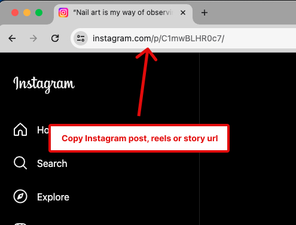
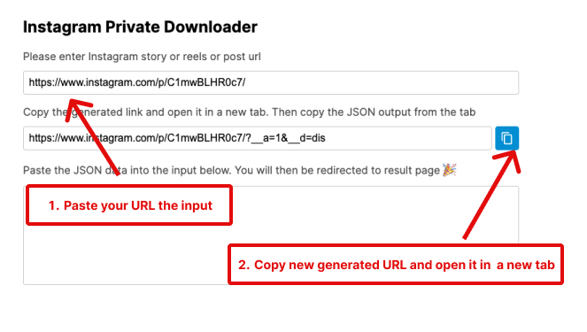
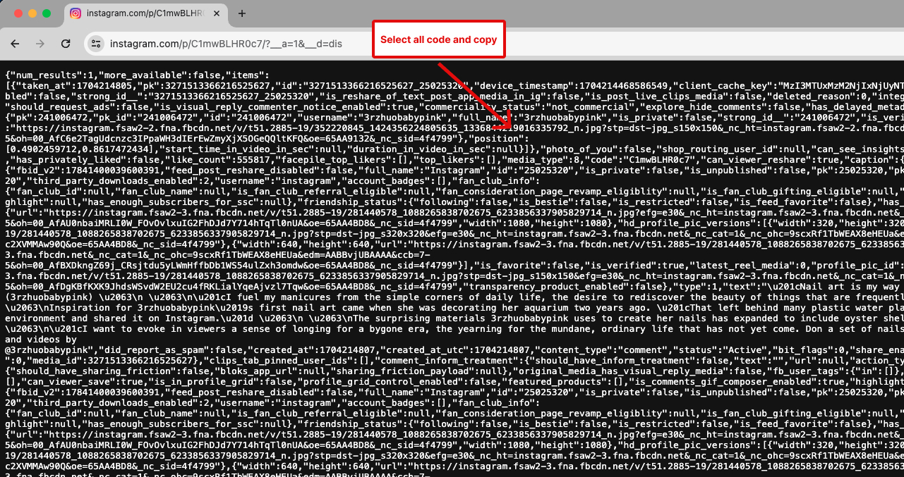
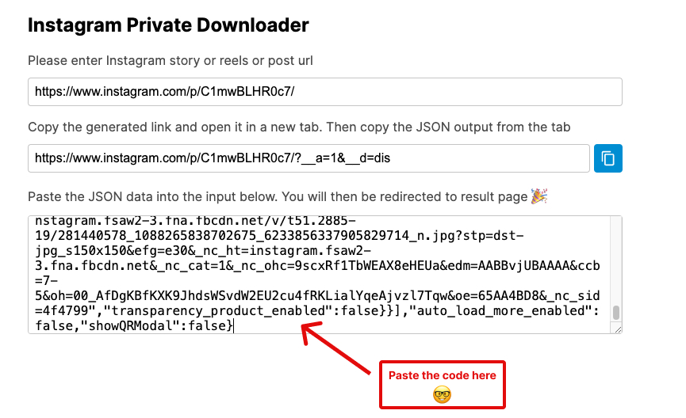

<h3 align="center">
  <br />
   <a  href="https://github.com/yasinatesim/instagram-media-downloader"></a>
  <br />
Instagram Media Downloader
  <br />
</h3>

<hr />

<p  align="center">Effortlessly download Instagram reels, stories, and posts without the need for user authentication. Enjoy seamless content saving in a user-friendly app.</p>


  <p align="center">
· <a  href="https://instagram-media-downloader.yasinatesim.vercel.app/">View App</a>
  </p>

## 📖 About

**Instagram Media Downloader:**

Effortlessly download Instagram reels, stories, and posts with our user-friendly app. No login needed! 🚀

**Features:**
- **Profile Picture:**  Instantly download full size Instagram profile pictures.
- **Story Download:** Easily save your favorite stories.
- **Highlights Download:** Save Instagram highlights effortlessly.
- **Post Download:** Download Instagram posts hassle-free.
- **Reels Download:** One-click download for Instagram reels.

Simplify your media saving experience! No login, no hassle. Enjoy Instagram content offline. 📲✨


### 📚Tech Stack

<table>

  <tr>
    <td> <a href="https://github.com/dilame/instagram-private-api">dilame/instagram-private-api</a></td>
    <td>NodeJS Instagram private API SDK. Written in TypeScript.</td>
  </tr>
<tr>

<td>

<a  href="https://nextjs.org/">Next.js</a>

</td>

<td>The React Framework for SEO Friendly website and more...</td>

</tr>

<tr>

<td>

<a  href="https://github.com/conventional-changelog/commitlint">Commitlint</a>

</td>

<td>Send commit messages to <a  href="https://www.conventionalcommits.org/en/v1.0.0/">conventional commits</a> rules</td>

</tr>

  <tr>
    <td><a href="https://www.typescriptlang.org/">TypeScript</a></td>
    <td>TypeScript is a strongly typed programming language that builds on JavaScript, giving you better tooling at any scale.</td>
  </tr>

<tr>

<td>

<a  href="https://github.com/css-modules/css-modules">CSS Modules</a>

</td>

<td>Class names and animation names are scoped locally CSS files</td>

</tr>

<tr>

<td>

<a  href="https://sass-lang.com/">SASS</a>

</td>

<td>The most mature, stable, and powerful professional grade CSS extension language in the world</td>

</tr>

<tr>

<td>

<a  href="https://editorconfig.org/">Editorconfig</a>

</td>

<td>Helps maintain consistent coding styles for my working on the same project across various editors and IDEs</td>

</tr>

<tr>

<td>

<a  href="https://eslint.org/">Eslint</a>

</td>

<td>Find and fix problems in your JavaScript code</td>

</tr>

<tr>

<tr>

<td>

<a  href="https://www.npmjs.com/package/eslint-plugin-simple-import-sort">Eslint Simple Import Sort</a>

</td>

<td>Enforce consistent import order in your JavaScript code</td>

</tr>

<tr>

<td>

<a  href="https://prettier.io/">Prettier</a>

</td>

<td>An opinionated code formatter</td>

</tr>

</table>

## 🧐 What's inside?

### Instagram Story, Highlight, Reels and Post Downloader

1. Copy Instagram URL

   

2. Paste the URL into the first input on the page

   

3. Select and copy all JSON code from the tab

   

4. Paste the code into the input. You will then be redirected to the result page

   


### Instagram Full Size Profile Picture Downloader


## Getting Started

### 📦 Prerequisites

- Node (v18.17.0+)

- Npm (v9.0.0+)

### ⚙️ How To Use


1. Clone this repository

```bash

git clone https://github.com/yasinatesim/instagram-media-downloader.git

```


2. Add .env file on root

```bash

# Your Firebase - Firestore Database info -> https://console.firebase.google.com/
NEXT_PUBLIC_FIREBASE_PRIVATE_KEY=
NEXT_PUBLIC_FIREBASE_PROJECT_ID=
NEXT_PUBLIC_FIREBASE_CLIENT_EMAIL=

# You need Google Recaptcha token for below field and you should add *localhost* domain in Google Recaptcha console "Domains" section
# https://www.google.com/recaptcha/admin/create
NEXT_PUBLIC_RECAPTCHA_SITE_KEY=
RECAPTCHA_SECRET_KEY=


# You need an Instagram account, please enter your Instagram account Username and Password
IG_USERNAME=
IG_PASSWORD=

# You need Instagram device string, please choose one on this link -> https://github.com/dilame/instagram-private-api/blob/623a348343e34058c3a286693740aa3698aed3cc/src/samples/devices.json

IG_DEVICE_STRING=

# The project uses to dilame/instagram-private-api.The library has `generateDevice` function and the function return the below fields. Please run this function in the dilame/instagram-private-api project and enter the below fields

# https://github.com/dilame/instagram-private-api/blob/623a348343e34058c3a286693740aa3698aed3cc/src/core/state.ts#L245
IG_DEVICE_ID=
IG_UUID=
IG_PHONE_ID=
IG_ADID=
IG_BUILD=

```


3. Install the project dependencies

```bash

npm install

```

**For Development**

```bash

npm run dev

```

### For Docker

Docker Build

```bash
docker build -t instagram-media-downloader .
```

Docker Run

```bash
docker run -p 3000:3000 -d instagram-media-downloader
```

App is running to [http://localhost:3000/](http://localhost:3000/)

### For Docker Compose

```bash
docker-compose up --build
```

App is running to [http://localhost:3000/](http://localhost:3000/)

**For Production Build &amp; Build Start**

```bash

npm run build

```

and

```bash

npm run start

```

**For Lint**

```bash
npm run lint
```


## 🔑 License

* Copyright © 2024 - MIT License.

See [LICENSE](https://github.com/yasinatesim/instagram-media-downloader/blob/master/LICENSE) for more information.

---

_This README was generated with by [markdown-manager](https://github.com/yasinatesim/markdown-manager)_ 🥲